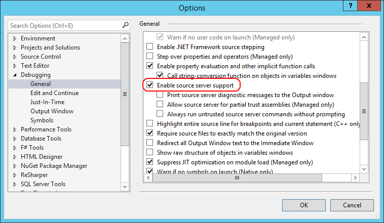

## 프로젝트 설정 {#project-setup}

시작하기 전에 프로젝트 설정 방법을 설명하겠습니다.

1. Visual Studio (.NET 4.5.2 이상)에서 새 콘솔 응용 프로그램 프로젝트를 만듭니다.
2. 솔루션 탐색기에서 프로젝트를 마우스 오른쪽 클릭하고 “Manage NuGet Packages…”를 선택합니다.
3. “**NBitcoin”**을 검색하여 설치합니다 (또는 MAC 및 Linux의 경우 NBitcoin.Mono).
  

> **Tip:** MAC 또는 Linux를 사용 중이고 NBitcoin.Mono 대신 NBitcoin을 참조하면 일부 클래스가 누락됩니다.

NBitcoin은 .NET 비트코인 라이브러리이자 오픈소스입니다, 이 책의 주요 저자 인 Nicolas Dorier가 관리합니다.
이 라이브러리는 C#에서 비트코인과 관련된 작업을 하는 경우 항상 포함되어야합니다.
NBitcoin은 크로스플랫폼 애플리케이션을 지원합니다.


## NBitcoin 소스 코드로 디버그하는 방법 (선택적)

NBitcoin을 사용하면 코드 디버깅을 더 쉽게 할 수 있습니다. 이 기능이 작동하려면 Visual Studio에서 소스 서버 지원이 활성화되어 있는지 확인하십시오 (Tools/Options -> Debugging/General -> Enable source server support).
  

이제, NBitcoin의 코드로 들어가면, 소스 코드가 GitHub에서 자동으로 가져와서, Visual Studio 디버거에 나타납니다.

# .NET Core에서 사용하는 방법

.NET Core를 사용하려면, [이곳에서](https://www.microsoft.com/net/core#windowsvs2017) .NET Core를 설치하세요.

그런 다음 명령 창에서 아래 문장 실행:
```
mkdir MyProject
cd MyProject
dotnet new console
dotnet add package NBitcoin
dotnet restore
```
Program.cs 수정:
```
using System;
using NBitcoin;

namespace _125350929
{
    class Program
    {
        static void Main(string[] args)
        {
            Console.WriteLine("Hello World! " + new Key().GetWif(Network.Main));
        }
    }
}
```
다음 명령으로 실행
```
dotnet run
```
