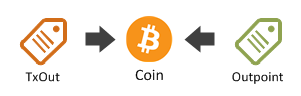
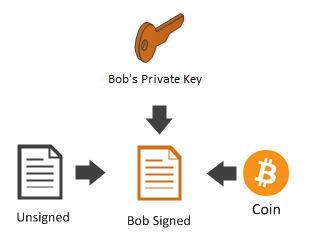

## MultiSig {#multi-sig}

비트코인은 다중서명(multi-signature, multisig)을 이용해 코인의 소유권을 공유하거나 제한할 수 있습니다.

우리는 이를 증명하기 위해 **m-of-n 다중서명**을 나타내는 ```ScriptPubKey```를 만들 것입니다.
이는 코인을 사용하기 위해서, n개의 서로 다른 공개 키 중에서 m개의 개인 키가 지출 트랜잭션을 서명하기 위해 필요함을 의미합니다.

지출 트랜잭션에 서명하기 위해 세 명 중 두 명이 필요한 Bob, Alice 그리고 Satoshi의 다중서명을 만들어 봅시다.

```cs
Key bob = new Key();
Key alice = new Key();
Key satoshi = new Key();

var scriptPubKey = PayToMultiSigTemplate
    .Instance
    .GenerateScriptPubKey(2, new[] { bob.PubKey, alice.PubKey, satoshi.PubKey });

Console.WriteLine(scriptPubKey);
```  
공개 키(Destination 주소)로 사용할 수 있는 스크립트를 생성하세요:
```
2 0282213c7172e9dff8a852b436a957c1f55aa1a947f2571585870bfb12c0c15d61 036e9f73ca6929dec6926d8e319506cc4370914cd13d300e83fd9c3dfca3970efb 0324b9185ec3db2f209b620657ce0e9a792472d89911e0ac3fc1e5b5fc2ca7683d 3 OP_CHECKMULTISIG
```  

위에서 알 수 있듯, ```scriptPubkey```는 해당 형태를 따릅니다: ```<sigsRequired> <pubkeys…> <pubKeysCount> OP_CHECKMULTISIG```  

다중서명을 서명하기 위한 과정(그것을 지출하기 위해서)은, 그저 ```Transaction.Sign```을 사용하는 것만으로는 작동하지 않고 조금 더 복잡합니다.

이후에 더 자세히 다뤄보도록 하고 지금은 트랜잭션에 서명을 하기 위해서 ```TransactionBuilder```를 사용할 것입니다.

```received```라고 하는 트랜잭션에서 코인을 받은 다중서명의 ```scriptPubKey```를 생각해 보세요:

```cs
var received = Transaction.Create(Network.Main)
received.Outputs.Add(Money.Coins(1.0m), scriptPubKey);
```  

Bob과 Alice는 서비스를 위해 Nico에게 1.0 BTC 송금을 합의했습니다.
먼저 그들은 이전에 받은 트랜잭션으로부터 ```코인```을 가져옵니다.

```cs
Coin coin = received.Outputs.AsCoins().First();
```  

  

이후, ```TransactionBuilder```를 이용해 **비서명된 트랜잭션**을 생성합니다.

```cs
BitcoinAddress nico = new Key().PubKey.GetAddress(ScriptPubKeyType.Legacy, Network.Main);
TransactionBuilder builder = Network.Main.CreateTransactionBuilder();
Transaction unsigned = 
    builder
      .AddCoins(coin)
      .Send(nico, Money.Coins(1.0m))
      .BuildTransaction(sign: false);
```  

아직 트랜잭션이 서명된 것은 아닙니다. 아래는 Alice가 서명하는 방법입니다:

```cs
Transaction aliceSigned =
    builder
        .AddCoins(coin)
        .AddKeys(alice)
        .SignTransaction(unsigned);
```  

  

그런 다음에 Bob이 서명합니다:

```cs
Transaction bobSigned =
    builder
        .AddCoins(coin)
        .AddKeys(bob)
        // 이 줄에서 SignTransaction(aliceSigned)는 SignTransaction(unsigned)와 동일한 기능을 가집니다.
        // 서명되지 않은 트랜잭션은 이전에 Alice의 개인키로 서명됐기 때문입니다.
        .SignTransaction(aliceSigned);
```  

  

이제, Bob과 Alice는 서명들을 하나의 트랜잭션으로 합칠 수 있습니다. 그 이후, 이 트랜잭션은 처음에 제공됐던 세 개(Bob, Alice, Satoshi)의 서명 중 두 개(Bob, Alice)가 사용됐기 때문에 유효해집니다. 그러므로 2-of-3 다중서명의 요구 사항을 충족했습니다. 만약 그렇지 않다면 네트워크는 일부 또는 모두 서명되지 않은 트랜잭션을 거부하기 때문에, 해당 트랜잭션을 거부할 것입니다.

```cs
Transaction fullySigned =
    builder
        .AddCoins(coin)
        .CombineSignatures(aliceSigned, bobSigned);
```  

  

```cs
Console.WriteLine(fullySigned);
```  

```json
{
  ...
  "in": [
    {
      "prev_out": {
        "hash": "9df1e011984305b78210229a86b6ade9546dc69c4d25a6bee472ee7d62ea3c16",
        "n": 0
      },
      "scriptSig": "0 3045022100a14d47c762fe7c04b4382f736c5de0b038b8de92649987bc59bca83ea307b1a202203e38dcc9b0b7f0556a5138fd316cd28639243f05f5ca1afc254b883482ddb91f01 3044022044c9f6818078887587cac126c3c2047b6e5425758e67df64e8d682dfbe373a2902204ae7fda6ada9b7a11c4e362a0389b1bf90abc1f3488fe21041a4f7f14f1d856201"
    }
  ],
  "out": [
    {
      "value": "1.00000000",
      "scriptPubKey": "OP_DUP OP_HASH160 d4a0f6c5b4bcbf2f5830eabed3daa7304fb794d6 OP_EQUALVERIFY OP_CHECKSIG"
    }
  ]
}

```
네트워크에 트랜잭션을 보내기 전, CombineSignatures() 메소드의 필요성을 살펴봐야 합니다: 'bobSigned'와 'fullySigned'를 철저하게 비교해보세요. 아마 동일한 것처럼 보일 것입니다. CombineSignatures() 메소드 없이도 트랜잭션은 적절하게 서명됐기 때문에 이런 경우에 CombineSignatures() 메소드는 필요없는 것처럼 느껴질 겁니다.

CombineSignatures()가 필요한 경우를 살펴봅시다:
```cs
TransactionBuilder builderNew = Network.Main.CreateTransactionBuilder();
TransactionBuilder builderForAlice = Network.Main.CreateTransactionBuilder();
TransactionBuilder builderForBob = Network.Main.CreateTransactionBuilder();

Transaction unsignedNew =
                builderNew
                    .AddCoins(coin)
                    .Send(nico, Money.Coins(1.0m))
                    .BuildTransaction(sign: false);

            
            Transaction aliceSigned =
                builderForAlice
                    .AddCoins(coin)
                    .AddKeys(alice)
                    .SignTransaction(unsignedNew);
            
            Transaction bobSigned =
                builderForBob
                    .AddCoins(coin)
                    .AddKeys(bob)
                    .SignTransaction(unsignedNew);
					
// 해당 경우에는 CombineSignatures() 메소드를 필수적으로 사용해야 합니다.
Transaction fullySigned =
                builderNew
                    .AddCoins(coin)
                    .CombineSignatures(aliceSigned, bobSigned);
```

트랜잭션이 네트워크로 보낼 준비가 됐습니다. 여기서 CombineSignatures() 메소드가 핵심이라는 것을 염두하세요. 그 이유는 aliceSigned와 bobSigned 트랜잭션은 그저 부분적으로 서명됐고, 이는 네트워크에서 받아들여지지 않기 때문입니다. CombineSignatures()는 두 개의 부분적으로 서명된 트랜잭션을 하나의 완전히 서명된 트랜잭션으로 합쳐줍니다.

> Sidenote: there is an inherent difficulty which arises from this situation. You need to send the newly created, unsigned multi-sig transaction to every signer and after their signed it, you also need to collect the partially signed transactions from them and combine them into one, so that you can publish that on the network. This problem is partially solved by the [BIP-0174](https://github.com/bitcoin/bips/blob/master/bip-0174.mediawiki), because it at least standardizes the data format, but you still need to implement your own way to distribute the data between the signing parties.  
> NBitcoin doesn't have an implementation for BIP-0174 or for the off-chain data distribution _yet_.

Although the Bitcoin network supports multisig as explained above, the one question worth asking is: How can you expect a user who has no clue about Bitcoin to pay to a complicated multisig script address containing Alice's, Bob's Satoshi's public keys as we have done?

Don’t you think it would be cool if we could represent such a ```scriptPubKey``` as easily and concisely as a regular Bitcoin Address?

Well, this is possible using something called a **Bitcoin Script Address** (also called Pay to Script Hash or P2SH for short).

오늘날에는 **네이티브 Pay To Multi Sig** (위에 예시처럼 사용)과 **네이티브 P2PK**는 절대 직접 사용되지 않습니다. 대신 **Pay To Script Hash** 지불로 불리는 무언가로 감싸(wrapped)집니다. 우리는 이 방식의 지불을 다음 부분에서 살펴볼 것입니다.
